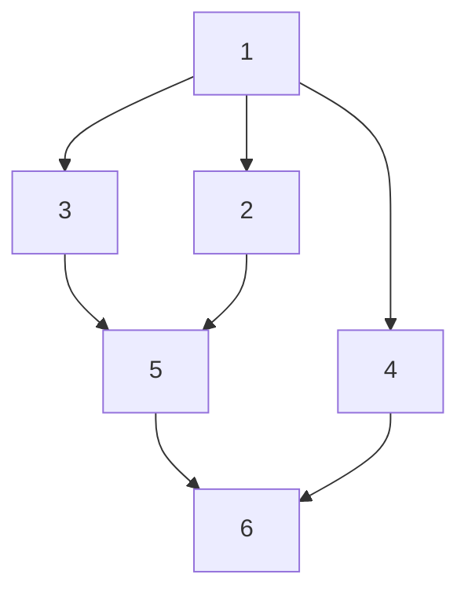
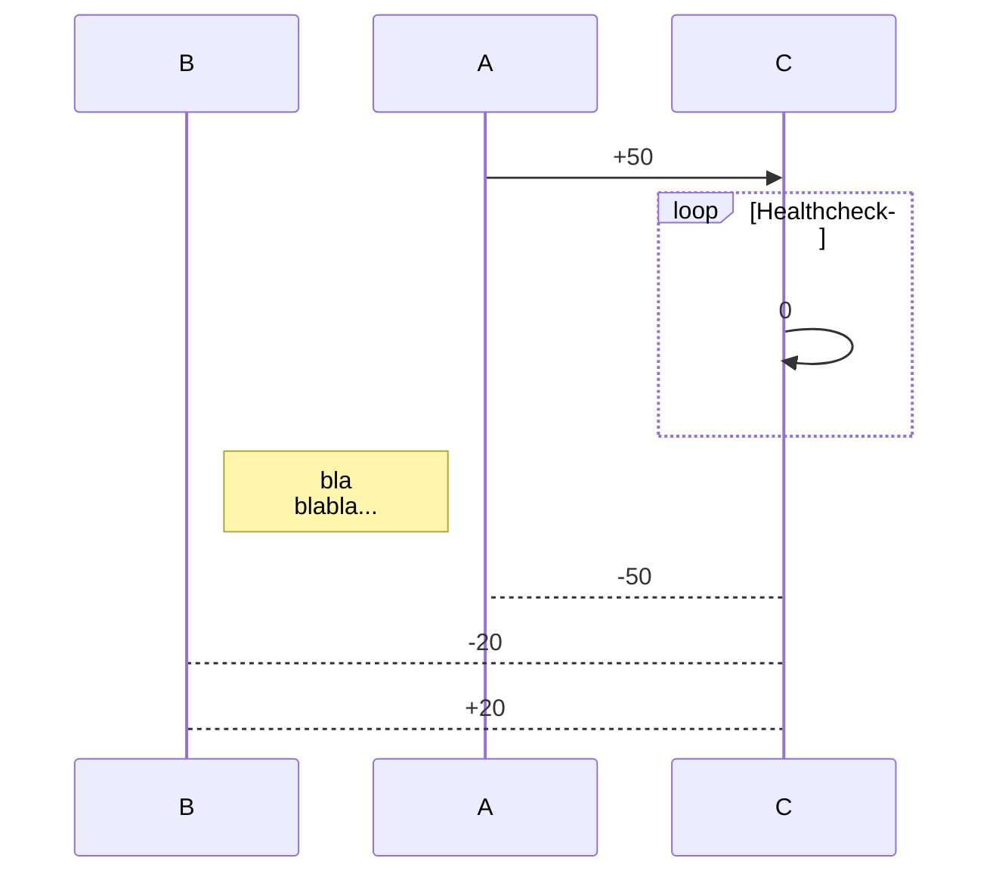
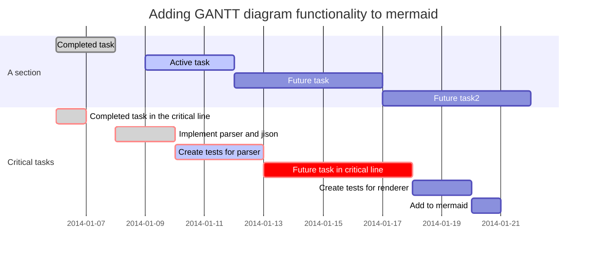

## graph

```mermaid
graph TD
    1-->2;
    1-->3;
    1-->4;
    3-->5;
    2-->5;
    5-->6;
    4-->6;    
```

## sequence diagram

```mermaid
sequenceDiagram
    participant B
    participant A
    participant C
    A->>C: +50
    loop Healthcheck
        C->>C: 0
    end
    Note left of A: bla<br/>blabla...
    C-->A: -50
    C-->B: -20
    B-->C: +20
```

## gantt chart

```mermaid
gantt
        dateFormat  YYYY-MM-DD
        title Adding GANTT diagram functionality to mermaid
        section A section
        Completed task            :done,    des1, 2014-01-06,2014-01-08
        Active task               :active,  des2, 2014-01-09, 3d
        Future task               :         des3, after des2, 5d
        Future task2               :         des4, after des3, 5d
        section Critical tasks
        Completed task in the critical line :crit, done, 2014-01-06,24h
        Implement parser and jison          :crit, done, after des1, 2d
        Create tests for parser             :crit, active, 3d
        Future task in critical line        :crit, 5d
        Create tests for renderer           :2d
        Add to mermaid                      :1d
```
